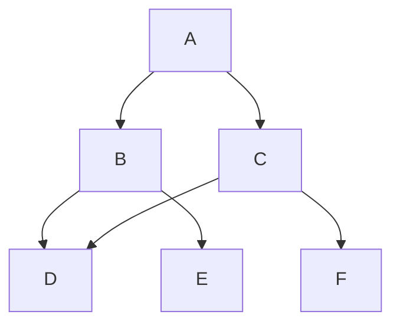

En Mathématiques ○ Physique Chimie ○ SVT ○ Info.

<!--more-->


Inscriptions ouvertes, places limitées.  
RSVP par sms au <a href="tel:0613835412">06 13 83 54 12</a>.


## Introduction

Le soutien scolaire est l'occasion de préparer efficacement son année au lycée et supérieur, dans un cadre bienveillant et une ambiance de travail collectif, en petits groupes. Il permet aux jeunes d’apprendre dans la bonne humeur et d’aider les autres, pour gagner en confiance et ouvrir le champs des possibles.

## Public

Lycée et supérieur: De la seconde à la terminale, et études supérieures (BTS, Prépa, Licence, Master).

## Dates et lieu

📍 À la médiathèque Pierresvives, la médiathèque Jean Jacques Rousseau, au centre social CAF l'ile aux familles, l’association GSC ou à domicile.  
📅 De 9h à 21h, en semaine ou week-end, sur rdv, dans la limite des places disponibles.



## 🎯 Objectifs

1. <b>Consolider</b> les acquis pour progresser. Réviser les notions clés et renforcer ses connaissances.
2. <b>Préparer</b> sereinement son entrée dans les classes supérieures en abordant la méthodologie et la confiance en soi.
3. <b>S’entraider</b>, s'informer, s’orienter, etc.

## Les avantages du soutien scolaire

- Une approche innovante, efficace et ludique alliant apprentissage, culture et sport, adapté aux jeunes, en petits groupes.
- Des supports et [exercices pour tous les niveaux](https://www.mtpcours.fr/c/maths/).
- Un bilan et un suivi pédagogique personnalisés.

## Programme

###  Tarifs individuels (groupe de 5 max)

| Séance | Mois | Trimestre |
|---|---|---|
| 1h30 | 4 séances | 10 séances |
| 15€ | 50€ | 120€ ou 12h de tutorat |

L'objectif du tutorat est d'encourager l'entraide et l'idée d'enseigner pour apprendre (méthode Feynman), ou de former des formateurs, pour perenisser l'action de soutien scolaire durablement. Il permet aux familles plus modestes de bénéficier d'une réduction sur le trimestre, par exemple de 30€ pour 3h de tutorat (2 séances de CLAS à co-animer comme bénévole en renfort). Enfin, le programme de soutien scolaire et de tutorat vise à donner plus d'autonomie aux jeunes, en leur permettant, à leur tour, de transmettre ce qu'ils et elles ont appris.

## FAQ


- Cours, exercices ou contrôles qui posent difficultés.
- Cahier, feuilles, stylo, compas, règle, équerre... le kit classique !


Partenaires associatifs et institutionnels